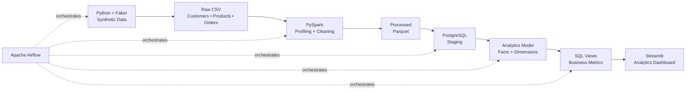
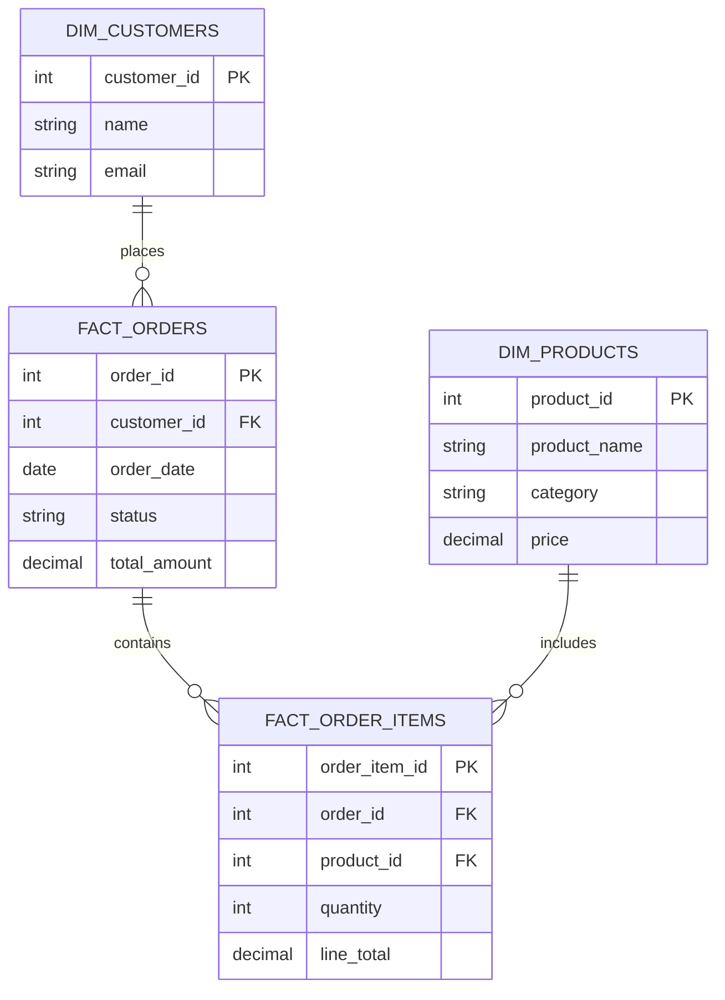
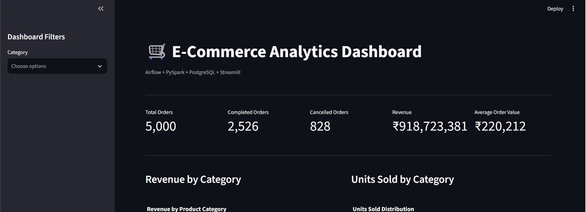

# 🛒 E-Commerce ETL & Analytics Platform

> **End-to-end batch data engineering pipeline built with Python, PySpark, PostgreSQL, Apache Airflow, Docker, and Streamlit.**

[](https://www.python.org/)
[](https://spark.apache.org/)
[](https://www.postgresql.org/)
[](https://airflow.apache.org/)
[](https://www.docker.com/)
[](https://streamlit.io/)

---

## 📌 Overview

This project implements a complete **e-commerce batch ETL and analytics platform** from raw data generation to business visualization.

The pipeline:

- Generates realistic synthetic e-commerce transactions
- Introduces intentional data-quality issues
- Profiles and validates raw data
- Cleans data using **PySpark**
- Stores curated data as **Parquet**
- Loads processed data into **PostgreSQL**
- Builds a dimensional analytics model
- Creates reusable analytical SQL views
- Orchestrates the workflow with **Apache Airflow**
- Provides an interactive **Streamlit + Plotly dashboard**

The goal was to build a realistic data engineering workflow rather than a collection of isolated scripts.

---

## 🏗️ Architecture



---

# ⚡ What I Built

### 1. Synthetic Data Generation

Generated realistic e-commerce data using **Python + Faker** across five datasets:

```text
Customers
Products
Orders
Order Items
Payments
```

Example pipeline dataset:

| Dataset | Records |
|---|---:|
| Customers | 1,000 |
| Products | 200 |
| Orders | 5,000 |
| Order Items | 14,923 |
| Payments | 4,432 |

---

### 2. Data Quality Engineering

Instead of generating perfectly clean data, the pipeline intentionally introduces common data-quality problems.

Examples:

- Duplicate customer records
- Missing customer emails
- Invalid email formats
- Invalid order-item quantities
- Different order statuses
- Orders without corresponding payments

---

### 3. PySpark Transformation

PySpark is used to transform the raw CSV data into curated Parquet datasets.

#### Customer cleaning

```text
Duplicate customers
        ↓
Deduplicate by customer_id
        ↓
Normalize email
        ↓
Validate email format
        ↓
Invalid email → NULL
```

#### Order-item cleaning

```text
Raw order items
        ↓
Validate quantity
        ↓
Remove quantity <= 0
        ↓
Curated order items
```

Cancelled orders without payments are retained because they represent a valid business scenario rather than automatically being treated as corrupt data.

---

# 🗄️ Data Warehouse Model

The PostgreSQL database is organized into two layers.

## Staging Layer

```text
staging.customers
staging.products
staging.orders
staging.order_items
staging.payments
```

The staging layer contains the cleaned transactional datasets.

## Analytics Layer

### Dimensions

```text
dim_customers
dim_products
```

### Facts

```text
fact_orders
fact_order_items
```

Conceptually:



---

# 🔄 Airflow ETL Workflow

The complete workflow is orchestrated using Apache Airflow.

### DAG

```text
ecommerce_etl
```

### Pipeline

```text
┌─────────────────────────────┐
│      generate_data          │
│      Python + Faker         │
└──────────────┬──────────────┘
               ↓
┌─────────────────────────────┐
│ clean_data_with_pyspark     │
│ Data Quality + Transformation│
└──────────────┬──────────────┘
               ↓
┌─────────────────────────────┐
│   load_parquet_to_postgres  │
│      PostgreSQL Staging     │
└──────────────┬──────────────┘
               ↓
┌─────────────────────────────┐
│     transform_analytics     │
│     Facts + Dimensions      │
└──────────────┬──────────────┘
               ↓
┌─────────────────────────────┐
│    create_dashboard_views   │
│       Business Metrics      │
└─────────────────────────────┘
```

The DAG is configured for daily execution.

---

# 📊 Analytics Layer

The project exposes reusable SQL views for analytical workloads.

```text
analytics.v_daily_sales
analytics.v_category_sales
analytics.v_product_sales
```

These provide:

- Daily revenue
- Daily order counts
- Units sold
- Category revenue
- Category order counts
- Product revenue

Cancelled orders are excluded from revenue-oriented analytics.

---

# 📈 Streamlit Dashboard

The processed analytics are exposed through an interactive Streamlit dashboard.

### Dashboard KPIs

```text
┌────────────────┬──────────────────┬─────────────────┐
│ Total Orders   │ Completed Orders │ Cancelled Orders│
│     5,000      │      2,526       │       828       │
└────────────────┴──────────────────┴─────────────────┘
```

Additional KPIs:

- Revenue
- Average Order Value

### Visualizations

📊 Revenue by Category

🥧 Units Sold Distribution

📈 Daily Revenue Trend

📊 Order Status Distribution

🏆 Top 10 Products by Revenue

📋 Category Performance

### Dashboard Filtering

The dashboard supports filtering by:

```text
Clothing
Electronics
Books
Home & Kitchen
Beauty
Sports
```

---
## 💻 Dashboard Preview



---

# 📊 Pipeline Results

One successful pipeline execution produced:

| Metric | Result |
|---|---:|
| Customers | 1,000 |
| Products | 200 |
| Orders | 5,000 |
| Order Items | 14,923 |
| Payments | 4,432 |

### Order Status

| Status | Orders |
|---|---:|
| Completed | 2,526 |
| Cancelled | 828 |
| Processing | 824 |
| Shipped | 822 |

---

# ✅ Data Validation

The analytical layer was independently validated against the underlying fact table.

### Category View Revenue

```text
₹918,723,381.34
```

### Fact Table Revenue

```text
₹918,723,381.34
```

### Difference

```text
₹0.00
```

This confirms that the revenue exposed through the category analytics view is consistent with the underlying order fact table.

---

# 🧪 Data Quality Checks

The pipeline includes checks for:

| Check | Handling |
|---|---|
| Duplicate customers | Deduplicated |
| Missing emails | Converted to NULL |
| Invalid email formats | Converted to NULL |
| Invalid quantities | Removed |
| Invalid prices | Validated |
| Referential integrity | Validated |
| Orders without payments | Investigated |
| Payment status | Profiled |

---

# 🛠️ Technology Stack

| Technology | Role |
|---|---|
| **Python** | Data generation & pipeline logic |
| **Faker** | Synthetic data generation |
| **PySpark** | Data cleaning & transformation |
| **Parquet** | Curated data storage |
| **PostgreSQL** | Staging & analytics database |
| **Apache Airflow** | Pipeline orchestration |
| **Docker** | Containerization |
| **Streamlit** | Analytics dashboard |
| **Plotly** | Data visualization |
| **Git** | Version control |

---

# 📁 Project Structure

```text
E-commerce ETL Pipeline/
│
├── dags/
│   └── ecommerce_etl.py
│
├── data/
│   ├── raw/
│   └── processed/
│
├── hadoop/
│   └── bin/
│       ├── hadoop.dll
│       ├── hdfs.dll
│       └── winutils.exe
│
├── notebooks/
│
├── sql/
│   ├── staging/
│   │   ├── 01_create_schemas.sql
│   │   └── 02_create_staging_tables.sql
│   │
│   └── analytics/
│       ├── 01_create_analytics_tables.sql
│       ├── 02_transform_analytics.sql
│       ├── 03_business_queries.sql
│       └── 04_dashboard_views.sql
│
├── src/
│   ├── dashboard/
│   │   └── app.py
│   │
│   ├── ingestion/
│   │
│   ├── loading/
│   │   └── load_to_postgres.py
│   │
│   ├── transformations/
│   │   └── clean_data.py
│   │
│   ├── data_quality.py
│   ├── profiling.py
│   └── generate_data.py
│
├── tests/
│
├── Dockerfile.airflow
├── docker-compose.airflow.yml
├── requirements.txt
├── .gitignore
└── README.md
```

---

# 🚀 Getting Started

## Prerequisites

- Python 3.12+
- Java 17
- Docker Desktop
- Git

## 1. Clone the Repository

```bash
git clone https://github.com/Subbu1412/ecommerce-etl-pipeline.git
cd E-commerce-ETL-Pipeline
```

## 2. Create Virtual Environment

### Windows

```powershell
python -m venv .venv
.\.venv\Scripts\Activate.ps1
```

## 3. Install Dependencies

```powershell
pip install -r requirements.txt
```

---

# 🐘 PostgreSQL

Start the PostgreSQL container:

```powershell
docker start ecommerce-postgres
```

Verify:

```powershell
docker ps
```

Check database connectivity:

```powershell
docker exec ecommerce-postgres pg_isready -U etl_user -d ecommerce
```

---

# ✈️ Airflow

Build the Airflow environment:

```powershell
docker compose -f docker-compose.airflow.yml build
```

Start Airflow:

```powershell
docker compose -f docker-compose.airflow.yml up -d
```

Open:

```text
http://localhost:8080
```

Trigger the:

```text
ecommerce_etl
```

DAG from the Airflow UI.

---

# 📊 Streamlit Dashboard

Run:

```powershell
streamlit run src\dashboard\app.py
```

Open:

```text
http://localhost:8501
```

---

# 🔐 Environment Configuration

Database configuration supports:

```text
PGHOST
PGPORT
PGDATABASE
PGUSER
PGPASSWORD
```

For production deployments, credentials should be managed using environment variables or a secrets manager.

---

# 🎯 Engineering Concepts

This project covers:

- Batch ETL
- Data ingestion
- Data profiling
- Data quality
- Data cleaning
- PySpark transformations
- Parquet
- PostgreSQL
- Fact and dimension modeling
- Analytical SQL
- SQL views
- Airflow orchestration
- Docker
- Data validation
- Business analytics
- Interactive dashboards

---

# 🔮 Future Improvements

- [ ] Incremental ETL processing
- [ ] Slowly Changing Dimensions
- [ ] Automated testing
- [ ] Data quality framework
- [ ] dbt transformation layer
- [ ] CI/CD pipeline
- [ ] Cloud Storage integration
- [ ] BigQuery warehouse
- [ ] Pub/Sub streaming ingestion
- [ ] GCP deployment
- [ ] Monitoring and alerting
- [ ] Production secrets management

---

# 👨‍💻 Author

## Peruri Subhash

**Data Engineer | GCP | PySpark | SQL | Airflow**

Building data pipelines, analytics systems, and cloud-based data engineering solutions.

---

⭐ **End-to-end data engineering project — from raw transactions to business insights.**
